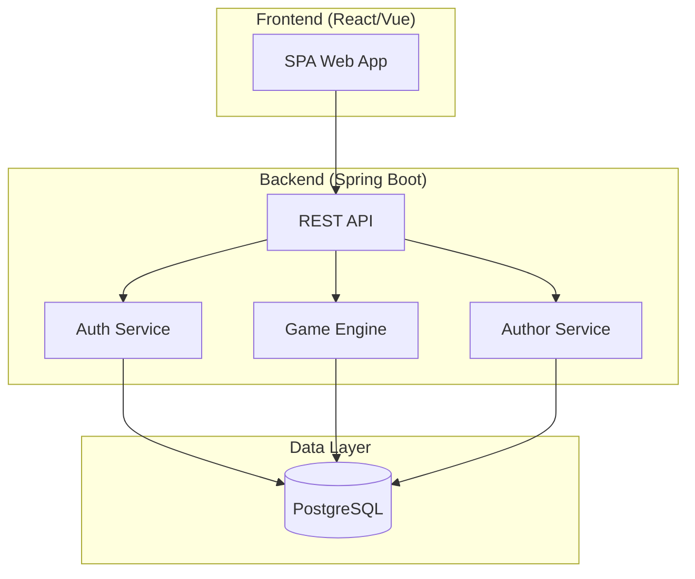
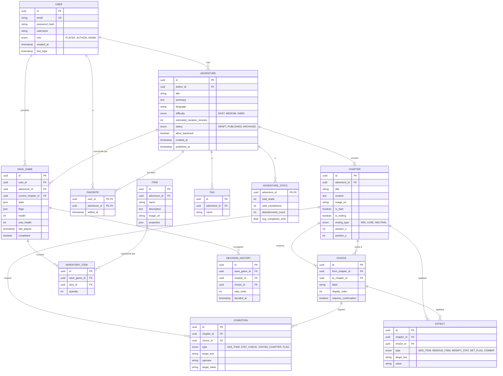
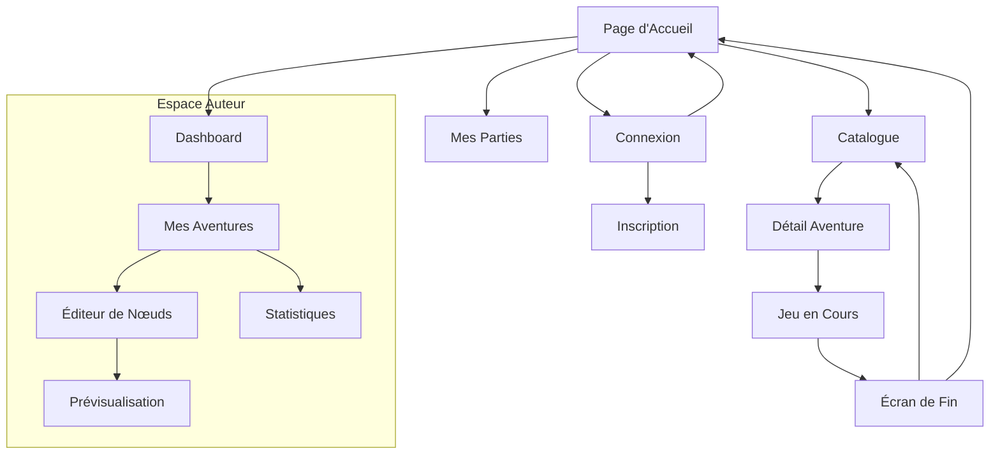
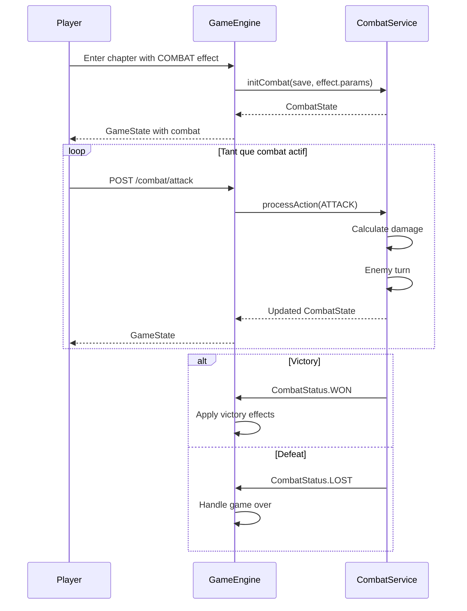

# Architecture Choose Your Own Adventure

Plateforme web complète pour jouer à des aventures interactives à embranchements, avec système d'auteurs, gestion de combats/équipements et synchronisation multi-appareils.

---

## 1. Vue d'Ensemble



---

## 2. Modèle de Données

### 2.1 Diagramme Entités-Relations



### 2.2 Description des Entités Principales

| Entité | Rôle |
|--------|------|
| **USER** | Joueur ou auteur. Rôle détermine les accès. |
| **ADVENTURE** | Une histoire complète avec métadonnées. |
| **CHAPTER** | Un nœud de l'histoire (texte + options). |
| **CHOICE** | Lien orienté entre chapitres avec label. |
| **CONDITION** | Prérequis pour voir/accéder à un choix ou chapitre. |
| **EFFECT** | Action déclenchée à l'entrée dans un chapitre ou au clic d'un choix. |
| **ITEM** | Objet définissable par l'auteur (équipement, clé, etc.). |
| **SAVE_GAME** | État de progression d'un joueur sur une aventure. |
| **INVENTORY_ITEM** | Items possédés dans une sauvegarde. |
| **DECISION_HISTORY** | Historique des choix pour backtrack/replay. |

---

## 3. Architecture Backend (Spring Boot)

### 3.1 Structure des Packages

```
com.cyoa.api/
├── config/
│   ├── SecurityConfig.java
│   ├── CorsConfig.java
│   └── JwtConfig.java
├── controller/
│   ├── AuthController.java
│   ├── AdventureController.java
│   ├── ChapterController.java
│   ├── GameController.java
│   ├── UserController.java
│   └── StatsController.java
├── service/
│   ├── AuthService.java
│   ├── AdventureService.java
│   ├── ChapterService.java
│   ├── GameEngineService.java
│   ├── ConditionEvaluator.java
│   ├── EffectProcessor.java
│   ├── CombatService.java
│   └── StatsService.java
├── repository/
│   ├── UserRepository.java
│   ├── AdventureRepository.java
│   ├── ChapterRepository.java
│   ├── ChoiceRepository.java
│   ├── SaveGameRepository.java
│   └── ...
├── entity/
│   └── (Toutes les entités JPA)
├── dto/
│   ├── request/
│   │   ├── LoginRequest.java
│   │   ├── CreateAdventureRequest.java
│   │   ├── CreateChapterRequest.java
│   │   └── MakeChoiceRequest.java
│   └── response/
│       ├── AdventureDetailResponse.java
│       ├── ChapterResponse.java
│       ├── GameStateResponse.java
│       └── UserProfileResponse.java
├── mapper/
│   └── (MapStruct mappers)
├── exception/
│   ├── GlobalExceptionHandler.java
│   ├── AdventureNotFoundException.java
│   └── InvalidChoiceException.java
└── security/
    ├── JwtTokenProvider.java
    ├── JwtAuthenticationFilter.java
    └── UserPrincipal.java
```

### 3.2 Endpoints API

#### 3.2.1 Authentification

| Méthode | Endpoint | Description |
|---------|----------|-------------|
| POST | `/api/auth/register` | Inscription |
| POST | `/api/auth/login` | Connexion → JWT |
| POST | `/api/auth/refresh` | Rafraîchir token |
| GET | `/api/auth/me` | Profil utilisateur courant |

#### 3.2.2 Catalogue (Public + Auth)

| Méthode | Endpoint | Description |
|---------|----------|-------------|
| GET | `/api/adventures` | Liste paginée avec filtres |
| GET | `/api/adventures/{id}` | Détail d'une aventure |
| GET | `/api/adventures/search` | Recherche full-text |
| GET | `/api/adventures/popular` | Top aventures |
| GET | `/api/adventures/recent` | Nouveautés |

**Query params pour `/api/adventures`:**
- `theme` : Filtre par tag
- `difficulty` : EASY, MEDIUM, HARD
- `language` : fr, en, etc.
- `minDuration` / `maxDuration`
- `sort` : popularity, date, title
- `page` / `size`

#### 3.2.3 Gameplay (Auth required)

| Méthode | Endpoint | Description |
|---------|----------|-------------|
| POST | `/api/game/{adventureId}/start` | Démarrer/reprendre une partie |
| GET | `/api/game/{saveId}/state` | État actuel (chapitre, inventaire, stats) |
| POST | `/api/game/{saveId}/choice/{choiceId}` | Faire un choix |
| POST | `/api/game/{saveId}/backtrack/{stepIndex}` | Revenir en arrière |
| GET | `/api/game/{saveId}/history` | Historique des décisions |
| GET | `/api/saves` | Toutes les sauvegardes du joueur |
| DELETE | `/api/saves/{saveId}` | Supprimer une sauvegarde |

#### 3.2.4 Combat (si applicable au chapitre)

| Méthode | Endpoint | Description |
|---------|----------|-------------|
| POST | `/api/game/{saveId}/combat/attack` | Attaque |
| POST | `/api/game/{saveId}/combat/defend` | Défense |
| POST | `/api/game/{saveId}/combat/use-item/{itemId}` | Utiliser objet |
| POST | `/api/game/{saveId}/combat/flee` | Fuir |

#### 3.2.5 Favoris

| Méthode | Endpoint | Description |
|---------|----------|-------------|
| GET | `/api/favorites` | Liste des favoris |
| POST | `/api/favorites/{adventureId}` | Ajouter |
| DELETE | `/api/favorites/{adventureId}` | Retirer |

#### 3.2.6 Backoffice Auteur (Role AUTHOR)

| Méthode | Endpoint | Description |
|---------|----------|-------------|
| GET | `/api/author/adventures` | Mes aventures |
| POST | `/api/author/adventures` | Créer aventure |
| PUT | `/api/author/adventures/{id}` | Modifier métadonnées |
| DELETE | `/api/author/adventures/{id}` | Supprimer |
| POST | `/api/author/adventures/{id}/publish` | Publier |
| POST | `/api/author/adventures/{id}/unpublish` | Dépublier |
| GET | `/api/author/adventures/{id}/validate` | Vérifier graphe (pas d'impasses) |
| GET | `/api/author/adventures/{id}/stats` | Statistiques |

#### 3.2.7 Chapitres & Choix (Backoffice)

| Méthode | Endpoint | Description |
|---------|----------|-------------|
| GET | `/api/author/adventures/{id}/chapters` | Liste des chapitres |
| POST | `/api/author/adventures/{id}/chapters` | Créer chapitre |
| PUT | `/api/author/chapters/{chapterId}` | Modifier chapitre |
| DELETE | `/api/author/chapters/{chapterId}` | Supprimer |
| POST | `/api/author/chapters/{id}/choices` | Ajouter choix |
| PUT | `/api/author/choices/{choiceId}` | Modifier choix |
| DELETE | `/api/author/choices/{choiceId}` | Supprimer |
| POST | `/api/author/chapters/{id}/conditions` | Ajouter condition |
| POST | `/api/author/chapters/{id}/effects` | Ajouter effet |
| GET | `/api/author/adventures/{id}/items` | Items de l'aventure |
| POST | `/api/author/adventures/{id}/items` | Créer item |

### 3.3 Service Game Engine

Le cœur du gameplay :

```java
@Service
public class GameEngineService {
    
    public GameStateResponse startOrResume(UUID userId, UUID adventureId);
    
    public GameStateResponse makeChoice(UUID saveId, UUID choiceId);
    
    public GameStateResponse backtrack(UUID saveId, int stepIndex);
    
    // Évalue les conditions pour filtrer les choix visibles
    private List<Choice> filterAvailableChoices(SaveGame save, Chapter chapter);
    
    // Applique les effets d'un chapitre/choix
    private void applyEffects(SaveGame save, List<Effect> effects);
    
    // Gère les fins
    private GameStateResponse handleEnding(SaveGame save, Chapter ending);
}
```

### 3.4 Validation du Graphe

```java
@Service
public class GraphValidationService {
    
    public ValidationResult validate(UUID adventureId) {
        // 1. Vérifier qu'il y a exactement un chapitre de départ
        // 2. Vérifier que tous les chapitres sont atteignables depuis le départ
        // 3. Vérifier qu'il existe au moins une fin
        // 4. Détecter les impasses (chapitres sans choix et non-fins)
        // 5. Vérifier les références (choix pointant vers chapitres existants)
    }
}
```

---

## 4. Architecture Frontend

### 4.1 Stack Proposée

- **Framework** : React 18 avec TypeScript
- **Routing** : React Router v6
- **State** : Zustand (léger) ou Redux Toolkit
- **UI** : Tailwind CSS + Headless UI
- **HTTP** : Axios avec interceptors JWT
- **Éditeur** : React Flow (pour l'éditeur de nœuds)
- **Build** : Vite

### 4.2 Structure des Dossiers

```
src/
├── api/
│   ├── client.ts           # Axios instance + interceptors
│   ├── auth.api.ts
│   ├── adventures.api.ts
│   ├── game.api.ts
│   └── author.api.ts
├── components/
│   ├── common/
│   │   ├── Button.tsx
│   │   ├── Card.tsx
│   │   ├── Modal.tsx
│   │   ├── Loader.tsx
│   │   └── ...
│   ├── catalog/
│   │   ├── AdventureCard.tsx
│   │   ├── AdventureGrid.tsx
│   │   ├── SearchBar.tsx
│   │   └── FilterPanel.tsx
│   ├── game/
│   │   ├── ChapterView.tsx
│   │   ├── ChoiceButton.tsx
│   │   ├── InventoryPanel.tsx
│   │   ├── StatsBar.tsx
│   │   ├── HistoryTimeline.tsx
│   │   ├── CombatView.tsx
│   │   └── EndingScreen.tsx
│   └── editor/
│       ├── NodeEditor.tsx
│       ├── ChapterNode.tsx
│       ├── ChoiceEdge.tsx
│       ├── ChapterPanel.tsx
│       ├── ConditionEditor.tsx
│       ├── EffectEditor.tsx
│       └── PreviewMode.tsx
├── pages/
│   ├── HomePage.tsx
│   ├── CatalogPage.tsx
│   ├── AdventureDetailPage.tsx
│   ├── GamePage.tsx
│   ├── ProfilePage.tsx
│   ├── SavesPage.tsx
│   ├── FavoritesPage.tsx
│   ├── LoginPage.tsx
│   ├── RegisterPage.tsx
│   └── author/
│       ├── DashboardPage.tsx
│       ├── AdventureListPage.tsx
│       ├── EditorPage.tsx
│       └── StatsPage.tsx
├── store/
│   ├── authStore.ts
│   ├── gameStore.ts
│   └── editorStore.ts
├── hooks/
│   ├── useAuth.ts
│   ├── useGame.ts
│   └── useDebounce.ts
├── types/
│   └── index.ts
├── utils/
│   └── ...
├── App.tsx
└── main.tsx
```

### 4.3 Flux de Navigation



### 4.4 Composants Clés

#### ChapterView
```tsx
interface ChapterViewProps {
  chapter: Chapter;
  availableChoices: Choice[];
  inventory: InventoryItem[];
  stats: PlayerStats;
  onChoice: (choiceId: string) => void;
  canBacktrack: boolean;
  onBacktrack: () => void;
}
```

#### NodeEditor (React Flow)
L'éditeur visuel permet de :
- Drag & drop des nœuds (chapitres)
- Connexion par flèches (choix)
- Double-clic pour éditer le contenu
- Validation en temps réel
- Preview jouable

---

## 5. Système de Combat

### 5.1 Modèle Simplifié

```java
public class CombatState {
    private int playerHealth;
    private int enemyHealth;
    private String enemyName;
    private int enemyAttack;
    private int enemyDefense;
    private boolean playerTurn;
    private CombatStatus status; // IN_PROGRESS, WON, LOST, FLED
}
```

### 5.2 Flow Combat



---

## 6. Sécurité

### 6.1 Authentification JWT

```
Authorization: Bearer <token>
```

- Access token : 15 min
- Refresh token : 7 jours (stocké httpOnly cookie)
- Rotation automatique du refresh token

### 6.2 Autorisations

| Role | Permissions |
|------|-------------|
| ANONYMOUS | Voir catalogue, détails aventures |
| PLAYER | + Jouer, sauvegarder, favoris |
| AUTHOR | + Créer/éditer ses aventures |
| ADMIN | + Gérer tous les contenus |

### 6.3 Validation

- Validation DTO avec Jakarta Validation
- Rate limiting sur auth endpoints
- Sanitization du contenu HTML (auteur)

---

## 7. Déploiement Docker

### 7.1 docker-compose.yml

```yaml
version: '3.8'

services:
  postgres:
    image: postgres:15-alpine
    environment:
      POSTGRES_DB: cyoa
      POSTGRES_USER: cyoa_user
      POSTGRES_PASSWORD: ${DB_PASSWORD}
    volumes:
      - postgres_data:/var/lib/postgresql/data
    networks:
      - cyoa-network

  api:
    build: ./choose-your-own-adventure-api
    environment:
      SPRING_DATASOURCE_URL: jdbc:postgresql://postgres:5432/cyoa
      SPRING_DATASOURCE_USERNAME: cyoa_user
      SPRING_DATASOURCE_PASSWORD: ${DB_PASSWORD}
      JWT_SECRET: ${JWT_SECRET}
    depends_on:
      - postgres
    networks:
      - cyoa-network
    ports:
      - "8080:8080"

  web:
    build: ./choose-your-own-adventure-web
    environment:
      VITE_API_URL: ${API_URL}
    depends_on:
      - api
    networks:
      - cyoa-network
    ports:
      - "3000:80"

volumes:
  postgres_data:

networks:
  cyoa-network:
```

### 7.2 Dockerfiles

**API (Spring Boot):**
```dockerfile
FROM eclipse-temurin:17-jdk-alpine AS build
WORKDIR /app
COPY . .
RUN ./mvnw clean package -DskipTests

FROM eclipse-temurin:17-jre-alpine
WORKDIR /app
COPY --from=build /app/target/*.jar app.jar
EXPOSE 8080
ENTRYPOINT ["java", "-jar", "app.jar"]
```

**Web (React/Vite):**
```dockerfile
FROM node:20-alpine AS build
WORKDIR /app
COPY package*.json ./
RUN npm ci
COPY . .
RUN npm run build

FROM nginx:alpine
COPY --from=build /app/dist /usr/share/nginx/html
COPY nginx.conf /etc/nginx/conf.d/default.conf
EXPOSE 80
```

---

## 8. Tests

### 8.1 Stratégie de Test (Backend)

| Type | Coverage cible | Outils |
|------|----------------|--------|
| Unit | Services, mappers | JUnit 5, Mockito |
| Integration | Repositories, Controllers | @SpringBootTest, TestContainers |
| E2E | Flux complets | RestAssured |

### 8.2 Tests Prioritaires

1. **GameEngineService** : Logique métier critique
2. **ConditionEvaluator** : Évaluation des conditions
3. **GraphValidationService** : Validation des aventures
4. **AuthService** : Sécurité
5. **Controllers** : Validation des DTOs

### 8.3 Commandes

```bash
# Lancer tous les tests
./mvnw test

# Tests avec couverture
./mvnw test jacoco:report

# SonarCloud
./mvnw sonar:sonar -Dsonar.projectKey=xxx -Dsonar.organization=xxx
```

---

## 9. CI/CD (GitHub Actions)

```yaml
name: CI/CD

on:
  push:
    branches: [main, develop]
  pull_request:
    branches: [main]

jobs:
  api:
    runs-on: ubuntu-latest
    steps:
      - uses: actions/checkout@v4
      - uses: actions/setup-java@v4
        with:
          java-version: '17'
          distribution: 'temurin'
      - name: Build & Test
        run: ./mvnw clean verify
      - name: SonarCloud
        run: ./mvnw sonar:sonar
        env:
          SONAR_TOKEN: ${{ secrets.SONAR_TOKEN }}
      - name: Build Docker
        run: docker build -t cyoa-api .

  web:
    runs-on: ubuntu-latest
    steps:
      - uses: actions/checkout@v4
      - uses: actions/setup-node@v4
        with:
          node-version: '20'
      - run: npm ci
      - run: npm run build
      - run: npm test
      - name: Build Docker
        run: docker build -t cyoa-web .
```

---

## 10. Prochaines Étapes

### Phase 1 : Foundation (Semaine 1-2)
- [x] Architecture documentée
- [ ] Setup projet Maven + Spring Boot
- [ ] Setup projet React + Vite
- [ ] Entités JPA + Flyway migrations
- [ ] Auth (register/login/JWT)

### Phase 2 : Core Features (Semaine 3-4)
- [ ] CRUD Adventures/Chapters/Choices
- [ ] Game Engine (play, save, backtrack)
- [ ] Catalogue + recherche
- [ ] Interface de lecture

### Phase 3 : Author Tools (Semaine 5)
- [ ] Éditeur de nœuds (React Flow)
- [ ] Validation du graphe
- [ ] Prévisualisation

### Phase 4 : Polish (Semaine 6)
- [ ] Combat system
- [ ] Statistiques
- [ ] Tests (>50% coverage)
- [ ] Déploiement Docker

---

## Verification

Ce document est un plan d'architecture uniquement. La vérification se fera lors de l'implémentation via :

1. **Tests unitaires** : `./mvnw test` (objectif >50% coverage)
2. **SonarCloud** : Analyse qualité du code
3. **Tests manuels** : Parcours de jeu complet
4. **Déploiement** : Test sur docker-compose de la classe
